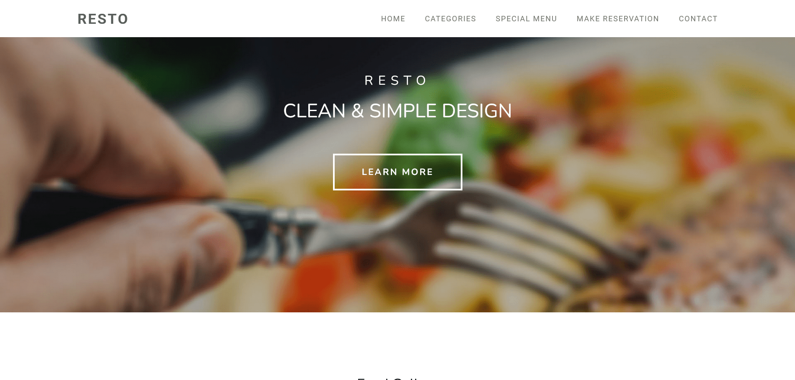

# Resto Project

Resto is a Laravel project designed to [implement a reservations system for a simple restaurant].

## Requirements

- PHP >= 8.3
- Laravel Framework 10.44
- Carbon package
- Tailwindcss 3.0.7 

## Installation

Follow these steps to set up the Resto project:

1. Clone the repository: `git clone [repository-url]`
2. Install dependencies: `composer install`
3. Set up environment variables: `cp .env.example .env`
4. Generate application key: `php artisan key:generate`
5. [Add any additional installation steps here]

## Usage

To run the resto project locally, use the following command:

```bash
npm install
npm run dev
php artisan serve


[def]: welcome.png
